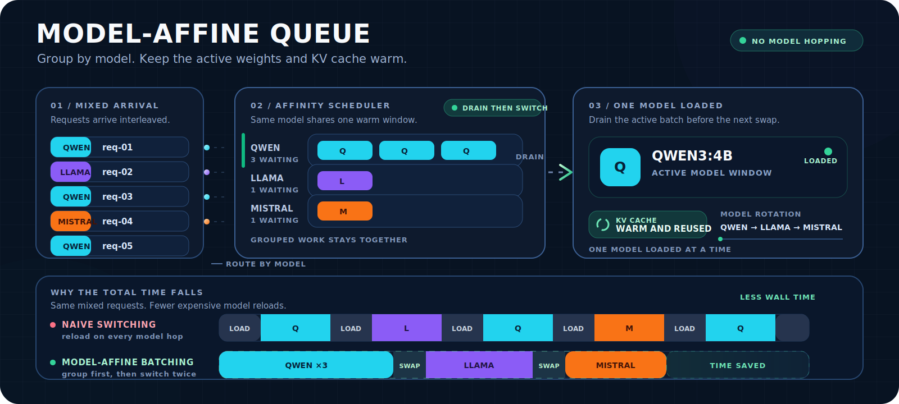

<p align="center">
  
</p>

<h1 align="center">Очередь Ollama с привязкой к модели</h1>

<p align="center">
  <a href="README.md">English</a> ·
  <a href="README.ru.md">Русский</a> ·
  <a href="README.zh-CN.md">中文</a>
</p>

Небольшой HTTP-прокси без внешних зависимостей. Он последовательно отправляет inference-запросы в Ollama: пока одна модель загружена, сначала обслуживаются все ожидающие запросы к ней, затем очередь переключается на следующую модель.

## Как это работает

1. Первый inference-запрос выбирает активную модель.
2. Все ожидающие запросы к этой модели обслуживаются первыми.
3. Прокси коротко ждёт новые запросы к той же модели.
4. Затем берётся самый старый запрос другой модели и выполняется переключение.

Запросы ждут в очереди и не отменяются из-за загрузки другой модели. `429` возвращается только при полном заполнении ограниченной очереди.

## Возможности

- только стандартная библиотека Python;
- нативные Ollama и OpenAI-compatible inference-маршруты;
- один worker на upstream, что помогает держать в памяти одну модель;
- модельная привязка с настраиваемым временем группировки;
- `/health` с активной моделью и глубиной очереди;
- логи `queue_enqueue`, `queue_start`, `queue_switch`, `queue_done`;
- Ollama менять не нужно.

## Установка

По умолчанию прокси слушает `127.0.0.1:11437`, а Ollama работает на `127.0.0.1:11434`.

```bash
sudo install -D -m 0755 ollama_model_queue_proxy.py \
  /usr/local/libexec/ollama_model_queue_proxy.py
sudo install -D -m 0644 systemd/ollama-model-queue-proxy.service \
  /etc/systemd/system/ollama-model-queue-proxy.service
sudo systemctl daemon-reload
sudo systemctl enable --now ollama-model-queue-proxy.service
```

Для одной загруженной модели настройте Ollama так:

```ini
# /etc/systemd/system/ollama.service.d/90-queue-runtime.conf
[Service]
Environment="OLLAMA_NUM_PARALLEL=1"
Environment="OLLAMA_MAX_LOADED_MODELS=1"
Environment="OLLAMA_MAX_QUEUE=64"
```

После этого выполните `sudo systemctl daemon-reload && sudo systemctl restart ollama`.

LiteLLM и другие клиенты должны использовать прокси вместо прямого порта Ollama. Для провайдера Ollama в LiteLLM укажите `http://127.0.0.1:11437` в качестве `api_base`.

## Переменные окружения

| Переменная | По умолчанию | Назначение |
| --- | --- | --- |
| `OLLAMA_QUEUE_LISTEN_HOST` | `127.0.0.1` | Адрес прослушивания |
| `OLLAMA_QUEUE_LISTEN_PORT` | `11437` | Порт прокси |
| `OLLAMA_UPSTREAM_URL` | `http://127.0.0.1:11434` | Адрес Ollama |
| `OLLAMA_MODEL_QUEUE_MAX` | `128` | Максимум ожидающих запросов |
| `OLLAMA_QUEUE_BATCH_GRACE_S` | `0.25` | Ожидание новых запросов той же модели |
| `OLLAMA_PROXY_FIRST_BYTE_TIMEOUT_S` | `180` | Таймаут первого байта upstream |
| `OLLAMA_QUEUE_MAX_REQUEST_BYTES` | `67108864` | Максимальный размер JSON-запроса |
| `OLLAMA_QUEUE_LOG_LEVEL` | `INFO` | Уровень логирования |

Планировщик намеренно оптимизирован под модельную локальность, а не под строгую справедливость. Если одна модель постоянно получает работу, запросы другой могут ждать — это снижает число дорогих перезагрузок модели.

## Проверка

```bash
curl -fsS http://127.0.0.1:11437/health
curl -fsS http://127.0.0.1:11437/api/tags

curl -fsS http://127.0.0.1:11437/api/generate \
  -H 'Content-Type: application/json' \
  -d '{"model":"qwen3:4b-instruct","prompt":"queue smoke","stream":false,"options":{"num_predict":2}}'
```

Логи переключения:

```bash
journalctl -u ollama-model-queue-proxy.service -f
```

## Тесты

```bash
python3 -m py_compile ollama_model_queue_proxy.py
python3 -m unittest discover -s tests -v
```

## Лицензия

MIT — см. [LICENSE](LICENSE).
